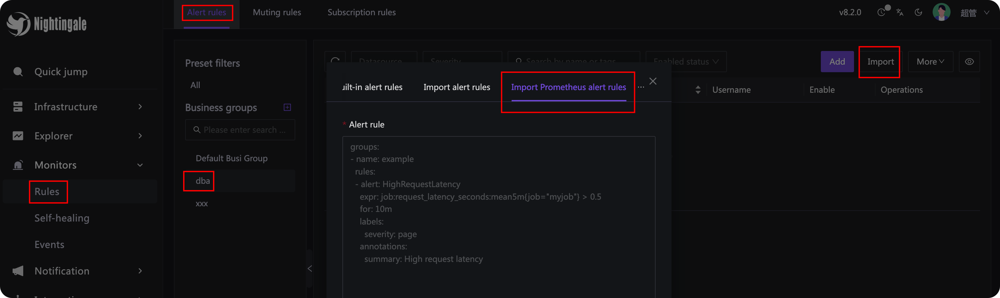
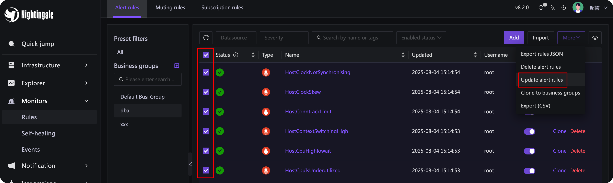
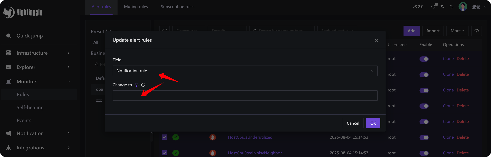

Many people in the Prometheus ecosystem have shared alerting rules, such as this project:

- [https://github.com/samber/awesome-prometheus-alerts/tree/master/dist/rules](https://github.com/samber/awesome-prometheus-alerts/tree/master/dist/rules)

Each directory contains alerting rules in YAML format. For example, the `host-and-hardware` directory includes common alerting rules for node-exporter. Want to directly import these rules into Nightingale? Please refer to the following steps.

## Version

Please use Nightingale version 8.2.0 or later.

## Import Steps

As shown in the screenshot above, go to the alerting rules page and select import to import Prometheus-format alerting rules. Note that the YAML-formatted rule content starts with `groups`, which contains multiple `group` entries. Each `group` has a `name` and `rules`, where `rules` is an array of specific alerting rules. Nightingale will ignore the `group`'s `name` during processing and directly import the content in `rules`.

After the import is complete, you usually need to associate notification rules to enable alert notifications. The method is: select the alerting rules in batches, then click "More Operations" in the upper right corner to batch update the alerting rules:

In the batch update pop-up, select "Notification rule" as the field, then choose the corresponding notification rule and click "Confirm". The screenshot is as follows:

