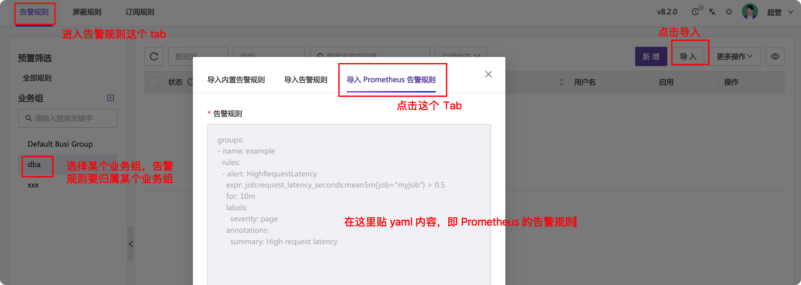
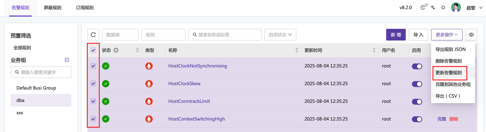
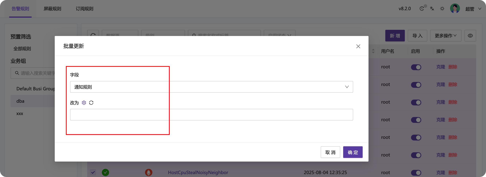

Prometheus 生态有很多人分享了告警规则，比如这个项目：

- [https://github.com/samber/awesome-prometheus-alerts/tree/master/dist/rules](https://github.com/samber/awesome-prometheus-alerts/tree/master/dist/rules)

每个目录下都是 yaml 格式的告警规则，比如 host-and-hardware 目录下就是常见的 node-exporter 的告警规则。想要把这些规则直接导入夜莺？请参考如下操作。

## 版本说明

请使用夜莺 v8.2.0 以上的版本。

## 导入步骤

如上截图。在告警规则页面选择导入，即可导入 Prometheus 格式的告警规则。注意那个 yaml 格式的规则内容，一开始是 groups，包含多个 group，每个 group 有 name 和 rules，rules 也是一个数组，里面是具体的告警规则。夜莺处理的时候会忽略 group 的 name，直接将 rules 中的内容导入。

导入完成之后，通常需要关联通知规则，才能做告警通知。方法是：批量选中告警规则，然后点击右上角的更多操作，批量更新告警规则：

在批量更新的弹层里，字段选择为：通知规则，然后选择对应的通知规则，点击确定即可，截图如下：

